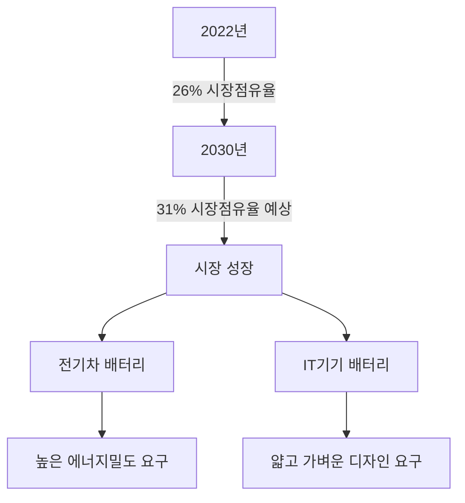
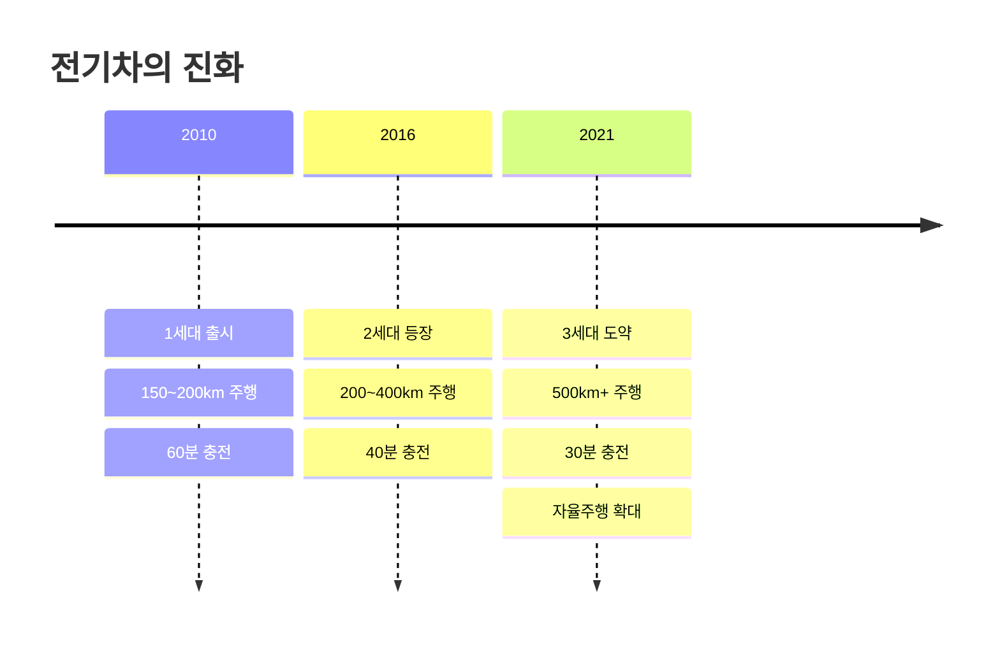
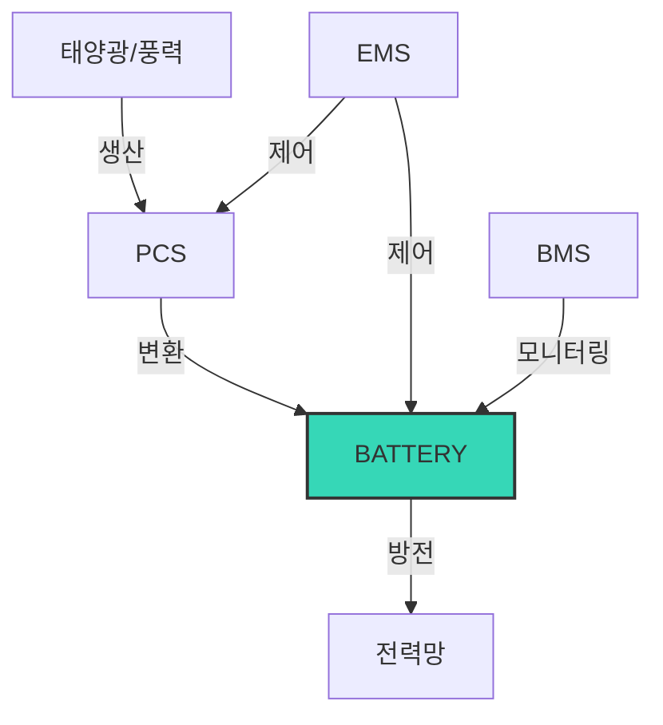
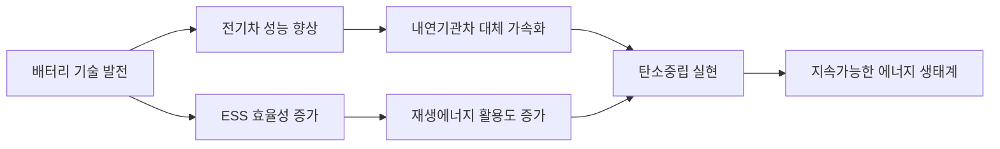

# 🔋 Ensolpedia Study - 배터리 산업의 현황을 파악한다 - 배터리 종류와 활용
> 배터리는 다양한 형태와 규격으로 진화하며 우리 생활 곳곳에 활용되고 있다.  
> 본 포스팅에서는 배터리의 주요 종류와 활용 분야에 대해 살펴본다.

---

## 📚 목차

- 1\. [원통형 배터리(18650, 21700, 46시리즈)](#1)
- 2\. [파우치 배터리](#2)
- 3\. [HEV·PHEV·BEV](#3)
- 4\. [전기차 세대별 특징](#4)
- 5\. [폐배터리의 재사용과 재활용](#5)
- 6\. [ESS 산업과 2차전지](#6)

---

## 1. 원통형 배터리(18650, 21700, 46시리즈) 

### ⚡ 가격 경쟁력과 빠른 생산이 장점

원통형 배터리는 배터리 시장의 오랜 강자로, 가격 경쟁력과 빠른 생산이 최대 장점입니다. 이번 학습에서 원통형 배터리의 특징과 진화 과정을 살펴보았습니다.

#### 📋 원통형 배터리의 기본 특성

- **제조 방식**: 양극과 음극을 **와인딩 방식**(두루마리 휴지처럼 돌돌 말기)으로 생산
- **장점**: 표준화된 규격, 대량생산 용이, 가격 경쟁력 우수
- **규격 표기**: 숫자가 배터리 크기를 의미 (예: 18650 = 지름 18mm, 높이 65mm)

> 💡 **원통형 배터리 이름의 비밀**  
> 18650, 21700 같은 숫자는 배터리의 물리적 크기를 나타냅니다. 첫 두 자리는 지름(mm), 다음 세 자리는 높이(mm)를 의미합니다. 크기가 커질수록 에너지 저장용량이 높아집니다!

### 🔋 원통형 배터리의 3세대 진화

| 세대 | 모델 | 크기 | 등장 시기 | 주요 특징 | 주요 용도 |
|-----|------|-----|----------|---------|---------|
| 1세대 | **18650** | 18mm×65mm | 1990년대 | 노트북/IT 기기 표준 | 노트북, 소형 전자기기 |
| 2세대 | **21700** | 21mm×70mm | 2010년대 중반 | 18650 대비 50% 용량 증가 | 전기차, 전기바이크 |
| 3세대 | **4680(0)** | 46mm×80mm | 2020년대 | 에너지밀도 극대화 | 차세대 전기차 |

#### 📱 18650: 노트북의 주역에서 정체기까지

- **탄생 배경**: 컬러TV 등 가전제품에 맞는 크기로 개발
- **역사적 순간**: 2001년 LG화학(현 LG에너지솔루션)이 세계 최초 노트북용 원통형 리튬이온배터리 양산
- **전성기**: 2000년대 노트북, 모바일 기기 시장 성장
- **위기**: 2010년대 IT 기기의 슬림화로 정체기 진입

#### 🚗 21700: 전기차가 가져온 부활

- **특징**:
  - 지름 21mm, 높이 70mm로 18650보다 **크기 증가**
  - NC/M811 또는 NCMA 양극재 적용으로 **용량 50% 이상 증가**
  - 기존 18650 설비로 생산 가능한 **호환성**

> ⚠️ **전기차 배터리의 딜레마**  
> 18650으로 전기차 한 대를 구동하려면 수천 개의 배터리가 필요하고, 그만큼 무게가 증가해 에너지 효율이 떨어집니다. 이러한 문제를 해결하기 위해 더 큰 용량의 배터리가 필요했습니다.

#### 🚀 46시리즈: 미래를 위한 준비

- **종류**: 4680, 4695 등 다양한 길이로 구성
- **특징**: 지름 46mm로 대형화, 에너지밀도와 출력 극대화
- **시장 전망**: 4680(0) 배터리 수요 예측
  - 2023년: **10GWh**
  - 2025년: **155GWh**
  - 2030년: **650GWh**

### 📊 원통형 배터리의 활용 분야

- 소형 IT 기기 (노트북, 모바일 기기)
- 전동공구, 청소기 등 중형 가전
- 전기차 (Tesla 등)
- 전기바이크, 전동스쿠터 (LEV: Light Electric Vehicle)
- 대용량 에너지 저장장치 (ESS)

> 🌟 **학습 포인트**  
> 원통형 배터리는 시장 요구에 맞춰 꾸준히 진화해왔으며, 특히 전기차 시장의 성장과 함께 제2의 전성기를 맞고 있습니다. 앞으로 더 큰 용량과 높은 에너지밀도를 구현하기 위한 기술 경쟁이 더욱 치열해질 전망입니다.

## 2. 파우치 배터리 

### 📱 주머니에 쏙 들어가는 고밀도 에너지

파우치 배터리는 유연한 형태와 높은 에너지밀도로 최근 가장 주목받는 배터리 유형입니다. 이번 학습에서는 파우치 배터리의 특징과 활용 분야를 살펴보았습니다.

#### 💪 파우치 배터리의 강점

- **구조적 유연성**: 빈틈없이 공간을 채울 수 있어 에너지밀도가 높음
- **맞춤형 설계**: 원하는 모양으로 자유롭게 제작 가능
- **경량화**: 원통형/각형 배터리보다 무게가 가벼움
- **냉각 효율**: 넓은 표면적으로 열 관리 효율적

> 🔍 **파우치 배터리의 구조적 특징**  
> 파우치 배터리는 '디가싱(Degassing)' 과정을 통해 내부 가스를 제거하여 배터리 셀 팽창을 방지합니다. 이는 배터리의 수명과 안전성 향상에 중요한 역할을 합니다.

#### 🏭 LG에너지솔루션의 혁신적 디가싱 공법

LG에너지솔루션은 보다 효율적인 파우치 배터리 생산을 위해 배터리 셀을 수직으로 세워 가스를 제거하는 디가싱 공법을 개발했습니다. 이 기술로:

1. 생산 공정의 효율 향상
2. 제조 공정 품질 개선 
3. 가스 경쟁력 확보

기존 일반적인 파우치형 배터리의 디가싱 공정은 셀버 안에서 셀을 수평으로 눕인 상태로 진행해 불가피하게 전해질 일부의 누수를 감수해야 했습니다. LG에너지솔루션의 수직 디가싱 공법은 이러한 문제를 해결하고 생산 효율을 높였습니다.

### 📈 파우치 배터리의 시장 전망

- **시장 점유율**: 2022년 전기차 배터리 시장에서 각형에 이어 시장점유율 2위(26%)
- **성장 전망**: 2030년에는 시장점유율 31% 이상 예상
- **적용 분야**: 스마트폰, 태블릿 등 얇은 IT기기와 전기차에 주로 적용

> 💼 **산업적 가치**  
> 파우치 배터리는 높은 에너지밀도와 광범위한 활용도를 가진 매력적인 배터리 기술입니다. 특히 제품 소형화와 경량화가 중요한 현대 전자기기 시장에서 핵심 역할을 담당하고 있습니다.

## 3. HEV·PHEV·BEV 

### 🚗 배터리 역할에 따른 전기차(EV) 구분하기

전기차는 배터리 사용 방식과 역할에 따라 세 가지 유형으로 구분됩니다. 이번 학습에서는 각 유형의 특징과 차이점을 살펴보았습니다.

#### 📊 전기차 유형별 특징 비교

| 구분 | 전체 명칭 | 배터리 역할 | 주행 거리 | 충전 방식 |
|-----|---------|----------|----------|---------|
| **HEV** | Hybrid Electric Vehicle | 보조 동력원 | 내연기관 주도 | 자가 충전 |
| **PHEV** | Plug-in Hybrid Electric Vehicle | 단거리 전기 주행 | 혼합 모드 | 외부+자가 충전 |
| **BEV** | Battery Electric Vehicle | 유일한 동력원 | 순수 전기 | 외부 충전 |

#### 🔄 HEV: 하이브리드 전기차

- **개념**: 내연기관이 주 동력원, 배터리는 보조 역할
- **특징**: 
  - 엔진 보조용으로 배터리 용량 작음
  - 연비 향상이 주요 목적
  - 외부 충전 불필요 (엔진으로 자가 충전)
- **장점**: 기존 주유소 인프라 활용 가능, 배터리 적어 가격 저렴
- **단점**: 순수 전기 주행 불가능, 환경 개선 효과 제한적

> 🔋 **HEV의 배터리 시스템**  
> HEV는 주로 NiMH(니켈수소배터리)나 NCA(니켈코발트알루미늄) 배터리를 사용합니다. 엔진 부하를 줄이고 회생제동 에너지를 활용해 연비를 개선하는 것이 주 목적입니다.

#### 🔌 PHEV: 플러그인 하이브리드 전기차

- **개념**: HEV보다 4배에서 10배까지 큰 배터리 탑재
- **특징**:
  - 외부 전원으로 충전 가능
  - 단거리는 전기로만 주행 가능
  - 장거리는 내연기관 활용
- **충전 방식**: 외부 충전 + 자가 충전 병행
- **적합 사용자**: 전기차 충전 인프라가 부족한 지역 거주자

#### ⚡ BEV: 순수 전기차

- **개념**: 100% 배터리로만 운행하는 전기차
- **특징**:
  - 내연기관 없음
  - 대용량 배터리 탑재 (HEV/PHEV 대비 6~10배)
  - 충전소 인프라 필요
- **배터리 기술**: NMC(니켈망간코발트)이나 LMO(리튬망간산화물) 사용
- **장점**: 배출가스 제로, 유지비 저렴, 주행 소음 적음
- **단점**: 충전 인프라 의존도 높음, 초기 구매 비용 높음

### 🚘 전기차 기술의 발전과 세대별 특징

전기차, 특히 BEV의 기술은 빠르게 발전하고 있습니다. 세대별 특징을 정리해보았습니다.

#### 1세대 BEV (2010~2016년)
- **주행거리**: 1회 충전 시 150~200km
- **에너지밀도**: 250~350Wh/L
- **충전 시간**: 급속 60분(80%)
- **냉각채**: 냉방 약 33%
- **가격**: 내연기관 차량보다 비쌈

#### 2세대 BEV (2016~2021년)
- **주행거리**: 1회 충전 시 200~400km
- **에너지밀도**: 450~550Wh/L
- **충전 시간**: 급속 40분(80%)
- **냉각채**: 냉방 60~70%
- **인프라**: 인프라 확충 시작

#### 3세대 BEV (2021년~현재)
- **주행거리**: 1회 충전 시 500km 이상
- **에너지밀도**: 650~750Wh/L
- **충전 시간**: 급속 30분(80%)
- **냉각채**: 냉방 80% 이상
- **인프라**: 글로벌 확충 + 초고속 충전 + 히터펌프

> 🚀 **전기차의 미래**  
> 3세대 전기차는 주행거리, 충전 속도, 냉난방 성능 등에서 내연기관차와 비슷하거나 더 나은 수준에 도달했습니다. 앞으로 배터리 기술의 발전에 따라 전기차의 성능은 더욱 향상될 전망입니다.

## 4. 전기차 세대별 특징 

### 🛣️ 주행거리, 배터리 기술 발달에 비례한다!

전기차 세대별 특징을 살펴보면 배터리 기술의 발전에 따라 주행거리, 에너지밀도, 충전 속도 등이 크게 개선되었음을 알 수 있습니다.

#### ⏱️ 전기차 세대별 발전 타임라인

#### 🔋 세대별 핵심 기술 비교

| 구분 | 1세대 | 2세대 | 3세대 |
|-----|-------|-------|-------|
| **배터리 종류** | NCM111/NCA | NCM622/711 | NCM811/NCMA |
| **에너지밀도** | 250~350Wh/L | 450~550Wh/L | 650~750Wh/L |
| **냉/난방 효율** | 33% | 60~70% | 80% 이상 |
| **충전 인프라** | 매우 제한적 | 점진적 확충 | 초고속 확충 |
| **핵심 이슈** | 짧은 주행거리 | 충전 시간 | 완전 자율주행 |

> 💡 **기술 발전의 원동력**  
> 전기차 산업은 인사이즈의 증가와 ESG 관련 투자 확대, 정부의 지원정책 등에 힘입어 급속히 발전했습니다. 특히 배터리 에너지밀도 향상은 주행거리 문제를 해결하는 핵심 열쇠가 되었습니다.

### 🔬 전기차 시장의 트렌드

- **자동차 OEM들의 전동화 전략 가속화**
  - 주요 완성차 메이커들의 전기차 전환 로드맵 발표
  - 내연기관차 신규 모델 출시 중단 계획

- **지역별 전기차 정책**
  - **미국**: EV 충전 인프라 확대, 세제 혜택
  - **중국**: 13차 5개년 계획 중 전기차 확대 초점
  - **EU**: 엄격한 배출규제, CO2 제한
  - **한국**: 전기차/수소차 보급 확대 정책

- **소비자 인식 변화**
  - 환경 문제에 대한 관심 증가
  - 총소유비용(TCO) 관점에서 전기차의 경제성 인식 확산
  - 충전 인프라 확충으로 주행거리 불안(Range Anxiety) 감소

> 🌍 **글로벌 전기차 시장 전망**  
> 글로벌 컨설팅 기관 SNE리서치에 따르면, 전 세계 전기차(BEV/PHEV) 판매량은 2030년까지 연평균 30% 이상 성장할 것으로 예상됩니다. 특히 중국, 유럽, 미국을 중심으로 전기차 시장이 폭발적으로 성장할 전망입니다.

## 5. 폐배터리의 재사용과 재활용 

### ♻️ 탄소중립 사회를 위한 노력

전기차 시장의 성장과 함께 수명을 다한 폐배터리의 발생량이 급격히 늘어나고 있습니다. 이를 효율적으로 관리하기 위한 재사용과 재활용 전략을 학습했습니다.

#### 📊 폐배터리 발생 전망

- **글로벌 시장조사기관 블룸버그(Bloomberg) 예측**:
  - 2032년 110GWh 이상의 폐배터리 발생 예상
  - 이는 하루 평균 50km를 주행하는 전기차 110만 대를 구동할 수 있는 양
- **문제점**: 
  - 희귀 금속 자원 낭비
  - 환경오염 우려
  - 경제적 손실

### 🔄 폐배터리의 대표적인 활용법: 재사용과 재활용

#### 🔋 재사용(Reuse)의 개념과 프로세스

- **정의**: 전기차에 사용한 후 수명이 남은 폐배터리를 모아 일정의 과정을 거쳐 다양한 용도로 다시 사용하는 것
- **방식**:
  - 배터리의 잔존 수명(SoH)과 충전 상태(SoC)를 기준으로 재사용
  - 배터리 활용 목적에 따라 품질 수준 및 안전 규제를 정하는 솔루션 개발
- **활용 분야**:
  - 가정용 ESS(Energy Storage System)
  - 산업용 UPS(무정전 전원장치)
  - 전력 수요 관리 시스템
  - 재생에너지 저장장치
  
> 🏠 **LG에너지솔루션의 재사용 프로세스**  
> 1. 배터리 수거  
> 2. 선별 및 등급 분류  
> 3. 재사용 제품 판매/리퍼비싱  
> 4. 솔루션 개발

#### ♻️ 재활용(Recycle)의 개념과 가치사슬

- **정의**: 재사용이 불가능한 폐배터리를 분해하고 금속에 주목한 공법을 통해 다시 원재료로 만드는 것
- **중요성**: 
  - 희소금속 확보
  - 환경 보호
  - 자원 순환
  - 원가 경쟁력 확보
- **프로세스**:
  1. 배터리 수거
  2. 원재료 추출
  3. 배터리 소재 제조
  4. 양극재 생산

> 💰 **재활용의 경제적 가치**  
> 한번 폐배터리의 재활용은 재사용이 불가능한 배터리를 분해하고 금속에 주목한 공법을 통해 다시 원재료로 만들어, 이를 통해 다시 양극재, 음극재 등 소재와 셀로 제작한다. 이와 같은 작업은 완전한 '밸류체인(Value Chain)' 전반을 포괄하는 하나의 산업현 체계를 구축해야 한다.

### 📝 LG에너지솔루션의 순환형 체계 구축 노력

- **비전**: 기후위기에 대응한 전세계 탄소중립 실현을 위한 노력
- **목표**: 
  - 2030년 약 10조 원 규모로 예상되는 배터리 재활용 시장에 적극 대응
  - 2050년에는 약 60조 원까지 규모가 커질 것으로 전망
- **주요 활동**:
  - 배터리 재사용 관련해 배터리의 잔존 수명을 정확하게 판단하는 기법 자체적으로 개발
  - 완제품에서 해체되어 정제된 배터리를 활용한 상품 모색
  - 재사용 후 더 이상의 활용이 불가능한 배터리를 분해하고 정밀 재현에 양극재로 사용하는 선순환 체계 구축
  
> 🤝 **산업계 협력**  
> 2021년 5월 LG에너지솔루션은 재니티모더스(GM)의 합작법인 얼티엄셀즈(Ultium Cells)를 통해 북미 최대 배터리 재활용업체인 리싸이클(Li-Cycle)과 협약해 배터리 재활용에 대한 공동 연구개발을 추진 중입니다.

## 6. ESS 산업과 2차전지 

### ⚡ 안정적인 전력 저장 공급 시스템을 구축한다!

ESS(Energy Storage System)는 생산된 전력을 저장해 두었다가 필요할 시기에 공급함으로써 에너지 효율을 향상시키는 시스템입니다. 이번 학습에서는 ESS의 구조와 중요성을 살펴보았습니다.

#### 🔌 ESS의 구성과 주요 역할

ESS는 크게 다음 4가지 구성요소로 이루어져 있습니다:

1. **배터리(BATTERY)**: 전기 에너지 저장 장치
2. **PCS(Power Conversion System)**: 전력변환 장치, 교류와 직류 변환
3. **BMS(Battery Management System)**: 배터리 상태 모니터링 및 관리
4. **EMS(Energy Management System)**: 전체적인 에너지 흐름 제어 및 최적화

> 💡 **ESS의 핵심 기능**  
> ESS는 에너지 저장과 공급을 담당하는 소프트웨어와 하드웨어의 집합으로, 전력망의 안정성과 효율성을 높이는 중요한 역할을 수행합니다.

#### 🌞 ESS의 주요 기능과 활용

- **피크 저감**: 전력 사용량이 많은 시간대에 저장된 전기를 사용해 최대 부하 줄임
- **부하 평준화**: 전력 사용량이 적은 심야에 충전하고 사용량이 많은 낮 시간에 방전
- **신재생에너지 연계**: 태양광, 풍력 등 간헐적인 신재생에너지의 안정적 활용
- **비상 전력**: 정전 시 비상 전력 공급원으로 활용
- **주파수 조정**: 전력망의 주파수 안정화에 기여

| ESS 활용 사례 | 주요 혜택 | 적용 분야 |
|-------------|---------|---------|
| 피크 저감 | 전기요금 절감, 전력망 안정화 | 공장, 상업시설 |
| 신재생에너지 연계 | 간헐성 보완, 에너지 자립 | 태양광/풍력 발전소 |
| 주파수 조정 | 전력 품질 향상 | 전력 시스템 |
| 비상 전력 | 정전 대비 | 병원, 데이터센터 |
| 마이크로그리드 | 독립 전력망 구축 | 섬, 산간지역 |

> ⚠️ **ESS의 중요성**  
> 전력은 생산과 동시에 소비되어야 하는 특성이 있어, 저장이 어렵다면 전력 수급에 문제가 발생합니다. ESS는 이러한 문제를 해결하는 핵심 인프라로, 전력 시스템의 유연성과 회복력을 높입니다.

### 🌏 세계가 주목하는 ESS

글로벌 시장조사기관 SNE리서치에 따르면, 글로벌 ESS 시장 규모는 2019년 11GWh에서 2030년 438GWh로 약 40배 성장할 전망입니다.

#### 📊 지역별 ESS 시장 동향

| 지역 | 주요 정책 및 특징 | 발전 방향 |
|-----|----------------|---------|
| 미국 | ESS 설치 의무화, 세제 혜택, RPS에 ESS 포함 | 전력망 및 주파수 서비스의 다양한 성능 추진 |
| 중국 | 13차 5개년 계획 중 중앙가 개혁에 ESS 포함 | 도심기술 지지고 있으며 연구 및 지원 제재할 단개 |
| 일본 | 재생 보급화 지원, FIT 시행, 세제 혜택 등 | 2011년 대지진 이후의 전력에 따라 비상전력 확보 자원 |
| 유럽 | 재생에너지(REN) 이행 강화와 함께 다양한 전력 제련 추진 | 세계 최대 규모(100MW) ESS 구축 등 |
| 프랑스 | 태양광발전 자기 소비용 ESS 설치 시 지원 제도 | 환경파괴영 축소 위헤에 대한 신재생에너지 제대 |

#### 🔋 ESS와 LG에너지솔루션

한국 역시 ESS 산업의 성장력을 강화기 위해 노력하고 있습니다. 2017년에 정부가 발표한 '재생에너지 3020 계획'은 정부 주도로 전체 발전량에서 신재생 에너지 발전 비중을 20%까지 확대한다는 내용으로, 1MW 이상의 전력을 사용하는 대규모 공공기관 건물에 일정 비율의 ESS 설치 의무화를 포함하고 있습니다.

해당 발표 이후 국내 배터리 기업들은 ESS 배터리의 생산공법뿐 아니라 사용 관련이 산업체 확대와 납채 등 ESS 사업에 적극적으로 나서고 있습니다. 그중 단연 눈에 띄는 기업은 ESS 시스템 통합(SI) 전문 기업인 'NEC에너지솔루션'을 인수한 LG에너지솔루션입니다.

> 🚀 **LG에너지솔루션의 ESS 사업 전략**  
> NEC에너지솔루션 인수는 ESS용 배터리 공급을 넘어 시장 기획, 설계, 설치, 유지보수 등 ESS와 관련된 사업영역을 확장하기 위한 결정으로, 북미 시장을 세계 곳곳에서 140건 이상의 ESS를 설치한 NEC에너지솔루션의 트랙 레코드를 확보한 것입니다.

#### 🛠️ ESS 기술의 미래 전망

- **배터리 기술 발전**: 리튬이온배터리 외에도 바나듐 레독스 흐름 배터리, 나트륨-황 배터리 등 다양한 ESS용 배터리 개발 중
- **소프트웨어 혁신**: 인공지능과 빅데이터를 활용한 ESS 관리 시스템 고도화
- **재생에너지 확대**: 태양광, 풍력 등 재생에너지와 ESS의 연계 강화
- **마이크로그리드 확산**: 지역 단위의 에너지 자립 시스템 구축 증가

> 📚 **학습 정리**  
> ESS는 단순한 배터리 저장 장치가 아닌, 전력 시스템의 안정성과 효율성을 높이는 핵심 인프라입니다. 재생에너지의 보급 확대와 함께 ESS의 중요성은 더욱 커질 전망이며, 배터리 기술의 발전과 함께 ESS 시장도 지속적으로 성장할 것으로 예상됩니다.

---

# 💡 Ensolpedia Part 4 총정리

이번 Ensolpedia Part 4에서는 배터리 산업의 현황과 배터리의 종류 및 활용에 대해 살펴보았습니다. 주요 학습 내용을 요약하면 다음과 같습니다:

## 📋 핵심 내용 요약

1. **원통형 배터리(18650, 21700, 46시리즈)**
   - 가격 경쟁력과 생산성이 장점인 전통적 배터리 형태
   - 18650 → 21700 → 4680으로 진화하며 용량과 에너지밀도 향상
   - 전기차 시장의 성장으로 제2의 전성기 맞이중

2. **파우치 배터리**
   - 유연한 형태와 공간 활용성이 뛰어남
   - 디가싱 공법의 혁신으로 품질과 효율 향상
   - 2030년 시장점유율 31% 이상 예상

3. **HEV·PHEV·BEV**
   - 배터리 역할에 따른 전기차 유형 구분
   - HEV: 내연기관 보조, PHEV: 단거리 전기 주행, BEV: 100% 전기 구동
   - 각 유형별 특징과 장단점 이해

4. **전기차 세대별 특징**
   - 1세대(2010~2016): 150~200km 주행, 60분 충전
   - 2세대(2016~2021): 200~400km 주행, 40분 충전
   - 3세대(2021~현재): 500km+ 주행, 30분 충전, 냉난방 개선

5. **폐배터리의 재사용과 재활용**
   - 재사용(Reuse): 용도 변경하여 다시 사용
   - 재활용(Recycle): 소재 추출하여 원재료화
   - 순환경제 구축의 중요성과 산업 성장 가능성

6. **ESS 산업과 2차전지**
   - 전력 저장 및 관리 시스템의 구성과 역할
   - 피크 저감, 신재생에너지 연계 등 다양한 활용
   - 글로벌 시장 급성장 전망과 지역별 특징

## 🔮 배터리 산업의 미래 전망

배터리 기술의 지속적인 발전은 전기차 시장의 성장과 재생에너지의 확대를 가속화하며, 궁극적으로 탄소중립 실현에 기여할 것입니다. 특히 원재료 확보, 제조 기술 혁신, 재활용 체계 구축이 배터리 산업의 미래 경쟁력을 좌우할 핵심 요소가 될 것으로 전망됩니다.

> 🌱 **미래 연구 과제**  
> 다음 Ensolpedia에서는 배터리 시장의 최신 트렌드와 기술 혁신, 글로벌 경쟁 구도에 대해 더 깊이 있게 탐구해보면 좋을 것 같습니다.

---

> 📎 출처: [LG에너지솔루션 Ensolpedia](https://inside.lgensol.com/ensolpedia/)---