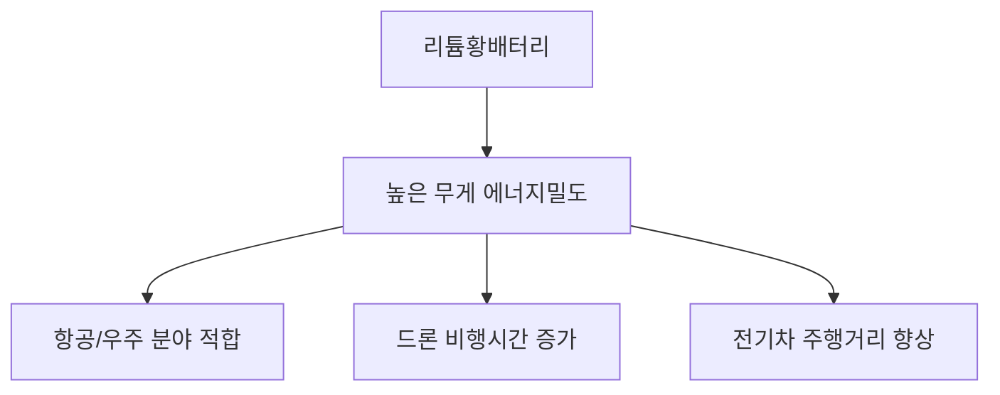
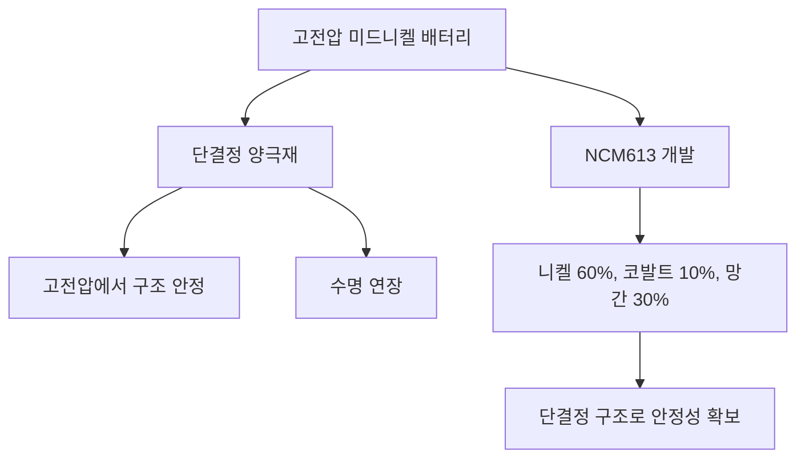
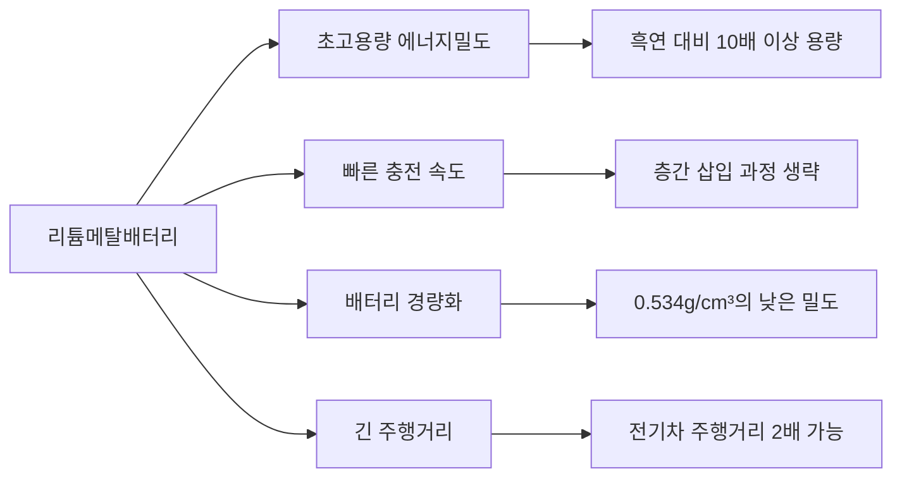
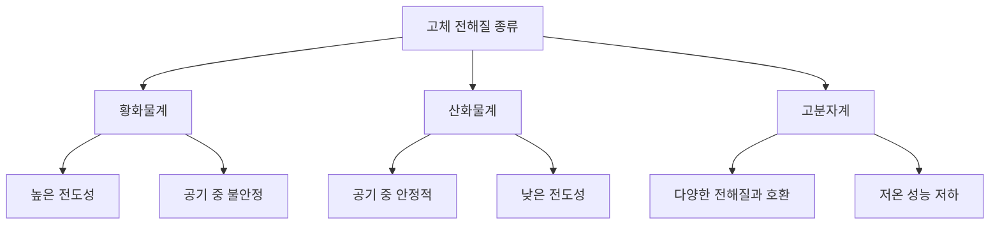
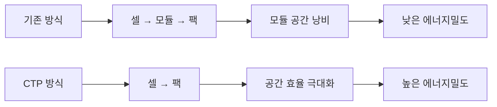
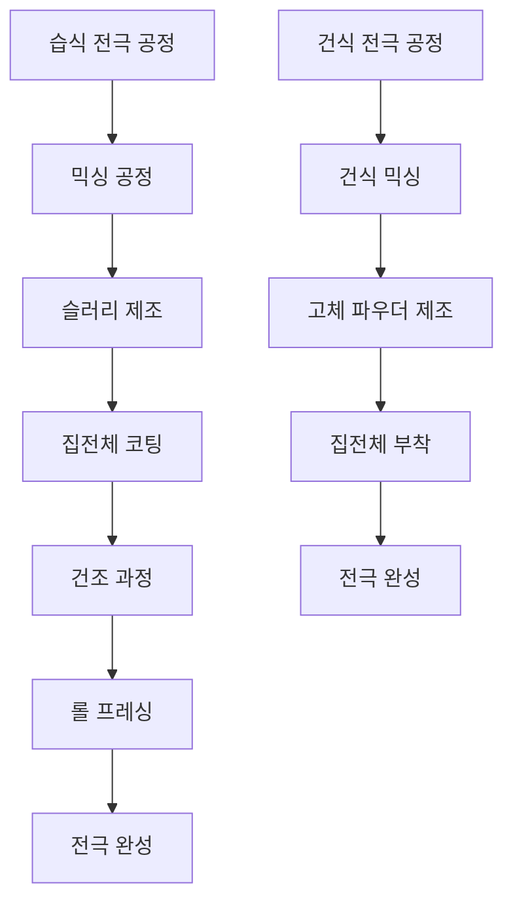
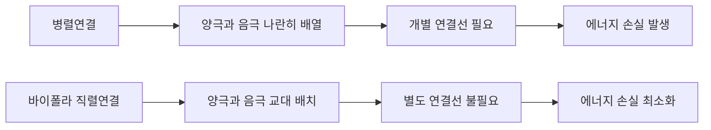
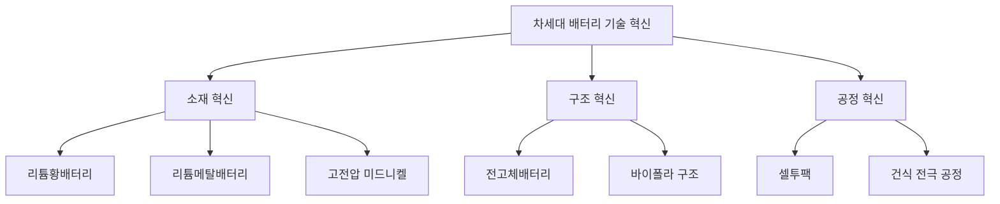

# 🔬 Ensolpedia Study - 배터리의 새로운 미래를 마주하다 - 차세대 배터리와 공정 혁신
> 배터리 기술은 끊임없이 진화하며 더 높은 에너지밀도와 안전성을 추구하고 있다.  
> 본 포스팅에서는 차세대 배터리 기술과 혁신적인 제조 공정에 대해 살펴본다.

---

## 📚 목차

- 1\. [리튬황배터리](#1)
- 2\. [고전압 미드니켈 배터리](#2)
- 3\. [리튬메탈배터리](#3)
- 4\. [전고체 배터리](#4)
- 5\. [셀투팩(CTP)](#5)
- 6\. [건식 전극 공정](#6)
- 7\. [바이폴라](#7)

---

## 1. 리튬황배터리 

### ⚡ 파우치 타입으로 더욱 극대화된 가벼움

리튬황배터리는 차세대 배터리 기술 중 가장 주목받는 기술 중 하나이다. 값싼 황을 활용하고 가벼운 특성으로 항공 및 우주 분야에서 특히 관심을 받고 있다.

#### 📋 리튬황배터리의 작동 원리

- **발견 역사**: 1991년 리튬이온배터리 상용화 이후 차세대 배터리로 연구 시작
- **기본 구조**: 양극에 황(S), 음극에 리튬 금속 사용
- **화학적 특성**: 리튬과 황의 반응으로 Li₂S₈ → Li₂S₆ → Li₂S₄ → Li₂S₂ → Li₂S 순으로 변화
- **이론적 우수성**: 황의 이론 용량 1,675mAh/g(리튬이온배터리의 약 8배)

> 💡 **황의 경제적 가치**  
> 황은 자연계에서 17번째로 풍부한 원소로, 비교적 쉽게 구할 수 있으며 가격도 매우 저렴하다. 이는 배터리 양극재 비용을 크게 줄일 수 있는 요소이다.

#### 📊 리튬황배터리와 리튬이온배터리 비교

| 특성 | 리튬이온배터리 | 리튬황배터리 | 우위 |
|-----|-------------|------------|-----|
| 에너지밀도 | ~250 Wh/kg | ~500 Wh/kg | 리튬황 ⬆️ |
| 이론 용량(양극재) | ~200 mAh/g | 1,675 mAh/g | 리튬황 ⬆️ |
| 원재료 비용 | 높음 (코발트, 니켈) | 낮음 (황) | 리튬황 ⬆️ |
| 무게 | 무거움 | 가벼움 | 리튬황 ⬆️ |
| 상용화 수준 | 완성 | 개발 중 | 리튬이온 ⬆️ |
| 수명 | 좋음 | 개선 필요 | 리튬이온 ⬆️ |

리튬황배터리는 무게 에너지밀도가 매우 높다. 이는 에너지(Wh)를 무게(kg)로 나눈 값으로, 특히 항공기나 드론처럼 무게가 중요한 분야에서 큰 장점이 된다.

> ⚠️ **리튬황배터리의 과제**  
> 리튬황배터리의 가장 큰 문제점은 '폴리설파이드 셔틀 현상'이다. 충방전 과정에서 발생하는 중간생성물(Li₂S₄, Li₂S₆, Li₂S₈)이 전해액에 녹아 이동하면서 활물질이 손실되고 수명이 단축된다.

#### 🚀 LG에너지솔루션의 연구 현황

LG에너지솔루션은 2013년부터 '혁신전지 프로젝트'를 통해 리튬황배터리 개발을 시작했다. 현재 한국화학연구원 및 KAIST와 협력하여 원천기술 개발에 주력하고 있다.

- **핵심 연구 방향**:
  - 폴리설파이드 셔틀 현상 방지를 위한 분리막 및 전해질 개발
  - 보론-피란(Borate-Pyran) 기반 전해액 시스템 적용
  - 안정적인 SEI(Solid Electrolyte Interphase) 층 형성 기술

- **미래 전망**:
  - 2027년 상용화 목표
  - 기존 전기차 대비 약 50% 향상된 주행거리(약 900km) 구현 가능
  - 400회 이상 재충전 가능한 수명 안정성 확보 계획

> 🔮 **응용 가능성**  
> 리튬황배터리는 무게 대비 에너지밀도가 우수하여 드론, 항공기, 우주 탐사 장비 등 경량화가 중요한 분야에서 혁신적인 변화를 가져올 것으로 예상된다.

## 2. 고전압 미드니켈 배터리 

### 💼 비용은 절감하고 안전성은 높이다

고전압 미드니켈 배터리는 경제성과 안전성을 모두 갖춘 배터리로, 전기차 시장의 중가 세그먼트를 겨냥하고 있다. 이 배터리는 니켈 함량을 적절히 조절하여 비용과 성능의 균형을 맞춘 것이 특징이다.

#### 📋 다양한 전기차 세그먼트를 위한 맞춤형 배터리

LG에너지솔루션은 전기차 시장을 다음과 같이 세 가지로 구분하여 맞춤형 배터리를 개발하고 있다.

- **Premium(고가)**: 최고급 전기차용 하이니켈 배터리
- **Standard(중가)**: 중형 전기차용 미드니켈 배터리
- **Affordable(저가)**: 경제형 전기차용 저가 배터리

미드니켈 배터리는 중가 시장을 타겟으로 하며, 니켈, 코발트, 망간으로 구성된 삼원계 배터리(NCM)이다. 니켈 함량이 40~60% 정도이며, 60% 미만인 경우 미드니켈로 분류된다.

> 💰 **경제성의 핵심**  
> 미드니켈 배터리는 고가의 코발트 사용량을 줄이고 상대적으로 저렴한 니켈과 망간의 비율을 최적화함으로써 원가 경쟁력을 확보한다. 특히 니켈 함량을 50~60%로 유지하면서도 고전압 기술을 적용하여 에너지밀도를 높이는 것이 핵심이다.

#### 🔋 고전압 구현을 위한 단결정 양극재 기술

고전압은 배터리의 에너지밀도를 높일 수 있지만 소재에 균열이 발생할 수 있는 문제가 있다. LG에너지솔루션은 이를 해결하기 위해 '단결정 양극재(Single-Crystal Cathodes)' 기술을 연구하고 있다.

| 양극재 유형 | 구조적 특징 | 장점 | 단점 |
|-----------|----------|-----|-----|
| 다결정 양극재 (Poly-Crystal) | 작은 입자들이 뭉쳐진 형태 | 제조 용이, 비용 효율적 | 고전압에서 균열 발생 위험 |
| 단결정 양극재 (Single-Crystal) | 하나의 큰 결정 구조 | 고전압에서 안정적, 수명 연장 | 제조 난이도 높음 |

단결정 양극재는 하나의 입자가 큰 결정으로 이루어져 고전압 환경에서도 안정적인 성능을 유지한다. 이는 리튬이온배터리의 양극재로 사용되는 니켈, 코발트, 망간 등의 금속 소재를 하나의 입자 형상(One Body)으로 만드는 기술이다.

#### 🔬 LG에너지솔루션의 기술적 성과

LG에너지솔루션은 2025년 내 고전압 미드니켈 NCM 배터리 양산을 목표로 하고 있다. 이 배터리의 에너지밀도는 670Wh/L로 높일 계획이며, 하이니켈 배터리 대비 열 안전성은 30% 이상 증대되고 가격은 약 8% 절감될 것으로 예상된다.

- **핵심 기술 성과**:
  - 고전압에서 구동 가능한 'NCM613' 소재 개발
  - 니켈 60%, 코발트 10%, 망간 30%의 최적 비율 구현
  - 단결정 양극재를 활용한 고전압 환경에서의 내구성 향상

> 🏆 **산업적 인정**  
> LG에너지솔루션은 세계 최초로 노트북 배터리에 미드니켈 함유 100%를 적용했으며, '안전배터리 어워즈 2022'에서 '미드니켈 함유 NCM 배터리'로 최고 혁신상을 수상하며 기술력을 인정받았다.

## 3. 리튬메탈배터리 

### 🔄 음극재 소재 변화로 용량을 향상시킨다

리튬메탈배터리는 음극에 리튬메탈을 사용하여 에너지밀도를 크게 높인 차세대 배터리이다. 이 기술은 음극재 소재 변화를 통해 배터리 성능의 혁신적인 향상을 추구한다.

#### 📝 음극재 개념에 대한 새로운 관점

리튬메탈배터리는 음극에 리튬메탈을, 양극에 리튬이온배터리와 동일한 금속산화물(Metal Oxide) 계통의 소재를 사용하고 있다. 음극에 리튬메탈 소재는 자체 배터리로 봤을 때 리튬황배터리(Lithium-sulfur Battery), 산소와 결합으로 구성하면 리튬공기배터리(Lithium-air Battery)가 된다.

- **역사적 배경**:
  - 리튬메탈배터리는 리튬이온배터리의 원형 모델
  - 1970년대 스탠리 위팅엄(Stanley Whittingham) 교수가 처음 개발
  - 양극에 이황화 티타늄(TiS₂), 음극에 리튬메탈 사용
  - 안전성 문제로 상용화되지 못함

> 💡 **덴드라이트 현상**  
> 리튬메탈이 전해질 속에서 반응할 때 생기는 나뭇가지 모양의 '덴드라이트(Dendrite)' 현상은 배터리 내부 단락을 일으킬 수 있어 리튬메탈배터리 상용화의 가장 큰 장애물이다.

#### 📊 리튬메탈배터리의 우수한 성능

리튬메탈배터리의 가장 큰 특징은 압도적인 에너지밀도이다.

| 특성 | 리튬이온배터리(흑연 음극) | 리튬메탈배터리 | 향상률 |
|-----|----------------------|-------------|-------|
| 이론 용량 | 372 mAh/g | 3,860 mAh/g | 약 10배 이상 |
| 밀도 | 2.2 g/cm³ (흑연) | 0.534 g/cm³ (리튬) | 무게 감소 |
| 충전 속도 | 보통 | 빠름 | 개선 |
| 주행 거리 | 기준 | 약 2배 향상 가능 | 크게 향상 |

리튬메탈배터리의 장점은 다음과 같다:

> ⚡ **충전 속도의 원리**  
> 리튬이온배터리는 충전 시 리튬이온이 흑연 층간에 삽입되어야 하지만, 리튬메탈배터리는 음극에 바로 전착되므로 충전 시간이 단축된다.

#### 🚗 LG에너지솔루션의 리튬메탈배터리 개발

LG에너지솔루션은 2013년 혁신전지 프로젝트를 통해 리튬메탈배터리 연구를 시작했다. 2021년에는 KAIST와 함께 리튬메탈배터리 원천기술 개발을 위한 공동연구소인 'FRL(Frontier Research Laboratory)'을 설립했다.

- **주요 연구 방향**:
  - 덴드라이트 생성 방지를 위한 전해질 시스템 개발
  - SEI 층 안정화 기술
  - 보론-피란(Borate-Pyran) 기반 전해액 개발

- **목표 성능**:
  - 약 900km 이상 주행 가능한 전기차용 배터리 개발
  - 2027년 상용화 시스템용 배터리 출시 목표
  - 리튬이온배터리 대비 50% 향상된 주행거리 구현

> 🌱 **미래 가능성**  
> 리튬메탈배터리는 전고체 전해질과 결합될 경우 리튬이온배터리 대비 최대 10배 이상의 성능을 보일 수 있는 잠재력을 가지고 있다. 이는 전기차 시장에 혁명적인 변화를 가져올 것으로 예상된다.

## 4. 전고체 배터리 

### 🛡️ 분리막을 대체할 고체 전해질로 고밀도 배터리 구현

전고체 배터리(All Solid-state Battery)는 액체 전해질 대신 고체 전해질을 사용한 차세대 배터리로, 안전성과 에너지밀도를 모두 향상시킨 궁극의 배터리 기술이다.

#### 🔍 안전성과 에너지밀도를 높인 혁신 기술

전고체 배터리는 기존 리튬이온배터리의 이론적 한계를 극복하기 위해 개발되었다. 액체 전해질 대신 고체 전해질을 사용함으로써 다음과 같은 이점을 제공한다:

- **안전성 향상**:
  - 액체 전해질은 가연성이 높지만 고체 전해질은 불연성
  - 열폭주 현상 방지로 배터리 안전사고 위험 감소
  - 고온에서도 안정적인 작동 가능

- **공간 효율성**:
  - 분리막이 필요 없어 배터리 내부 공간 활용도 증가
  - 배터리 셀 밀도 향상 가능
  - 고전압, 고용량 소재 적용 가능

> 🔥 **불이 붙지 않는 배터리**  
> 전고체 배터리의 가장 큰 장점은 불이 붙지 않는 안전성이다. 액체 전해질을 사용하는 기존 리튬이온배터리는 과충전이나 손상 시 화재 위험이 있으나, 고체 전해질은 이러한 위험을 크게 줄인다.

#### 🧪 고체 전해질의 세 가지 유형

전고체 배터리에 사용되는 고체 전해질은 크게 세 가지로 구분된다:

| 고체 전해질 유형 | 주요 특징 | 장점 | 단점 |
|---------------|---------|-----|-----|
| 황화물계 (Sulfide) | 가장 유망한 소재 | 높은 전도성 | 공기 중 황화수소 발생 위험 |
| 산화물계 (Oxide) | 공기 중 안정적 | 높은 안정성 | 계면 저항이 큼 |
| 고분자계 (Polymer) | 다양한 전해질과 호환 | 제조 공정 용이, 공정 비용 절감 | 저온에서 성능 저하 |

> ⚠️ **전도성과 안정성의 딜레마**  
> 황화물계는 전도성이 우수하지만 공기 중에서 불안정하고, 산화물계는 안정적이지만 전도성이 낮다. 이러한 상충 관계를 해결하는 것이 전고체 배터리 연구의 핵심 과제이다.

#### 🔋 다양한 음극재 적용 가능성

전고체 배터리는 다양한 음극재와 함께 사용될 수 있어 활용도가 높다:

- **리튬메탈 음극재**:
  - 액체 전해질에서는 화학적 반응성이 높아 문제가 되지만, 고체 전해질에서는 안정적
  - 충전 시 부피 팽창이 적어 전고체 배터리에 적합
  - 에너지밀도 대폭 향상 가능

- **실리콘 음극재**:
  - 흑연보다 이론용량이 크게 높아 에너지밀도 향상 가능
  - 충방전 과정에서 부피 변화가 크지만 고체 전해질이 이를 수용 가능
  - 고체 전해질과 함께 사용 시 부피 변화 문제 완화

#### 🚀 LG에너지솔루션의 장수명 전고체 배터리 개발

LG에너지솔루션은 2021년 미국 센디에이고대학교(UCSD)와 공동연구팀을 구성하여 전고체 배터리 연구와 개발에 박차를 가하고 있다.

- **주요 기술적 성과**:
  - 60°C 이상에서만 충전 가능했던 기존 기술의 한계 극복
  - 상온(약 25°C)에서도 빠른 충전이 가능한 장수명 전고체 배터리 기술 개발
  - 실리콘 음극에 5wt% 마이크로파티클 적용 연구 성공
  - 부피 변화가 큰 실리콘 음극을 고체 전해질로 안정화

- **성능 지표**:
  - 상온에서 충방전 수명 500회 이상, 이후 잔존 용량 80% 이상 유지
  - 리튬이온배터리 대비 에너지밀도 40% 이상 향상
  - 권위 있는 과학 저널 '사이언스(Science)' 게재로 기술력 인정(13732권 6562호)

> 🧠 **연구의 의의**  
> 이 연구는 전고체 배터리의 가장 큰 약점이었던 상온 작동 문제를 해결했다는 점에서 중요하다. 상용화를 위한 결정적인 장벽을 제거한 셈이다.

## 5. 셀투팩(CTP) 

### 🔌 모듈화 과정을 없앤 혁신 기술

셀투팩(Cell to Pack, CTP)은 배터리 제조 공정의 효율성을 높이고 에너지밀도를 향상시키는 혁신적인 기술이다. 기존의 '셀→모듈→팩' 구조를 '셀→팩'으로 단순화하여 공간 활용도를 극대화한다.

#### 📦 공간 사용으로 에너지밀도와 용량을 높이는 셀투팩

일반적인 배터리 셀의 직렬 연결 전압은 약 2.5~4.5V 내외이다. 전기차나 ESS(Energy Storage System)와 같은 고용량·고출력 애플리케이션에서는 여러 개의 배터리 셀을 모듈화하고 이를 연결한 배터리 팩을 사용한다.

LG에너지솔루션은 모듈과 팩을 통합한 MPI(Module Pack Integrated) 기술을 개발하여 배터리 성능 향상에 기여하고 있다.

> 💡 **CTP의 핵심 장점**  
> CTP는 모듈 케이스가 차지하는 공간까지 배터리 셀로 채울 수 있어 공간 활용도가 크게 향상된다. 또한 부품 수가 줄어 제조 시간 단축 및 비용 절감 효과도 있다.

#### 📊 CTP 기술의 효과

| 평가 항목 | 기존 배터리 구조 | CTP 구조 | 개선 효과 |
|----------|--------------|---------|---------|
| 에너지밀도 | 기준 | 5% 이상 향상 | 더 긴 주행거리 |
| 공간 활용 | 모듈 케이스로 인한 낭비 | 효율적 공간 활용 | 셀 수량 증가 |
| 부품 수 | 많음 | 적음 | 비용 및 무게 감소 |
| 제조 시간 | 길다 | 짧다 | 생산성 향상 |
| 안전성 관리 | 모듈 단위 | 팩 전체 | BMS 기술 발전 필요 |

셀투팩 기술은 배터리 팩 내의 '데드 스페이스(Dead Space)'를 최소화하여 에너지밀도 향상에 기여한다. 또한 모듈 케이스와 같은 부품 수가 줄어들어 무게가 감소하고 공간 활용도가 높아진다.

#### 🏭 LG에너지솔루션의 파우치 배터리 CTP 기술

LG에너지솔루션은 업계 최초로 파우치 배터리에 CTP 기술을 적용했다. 파우치 배터리는 무게가 가볍고 형태가 자유로워 CTP 구현에 적합하다.

- **파우치 CTP 배터리 제조 과정**:
  1. 파우치 배터리 셀을 배열하고 열 관리용 폼재(Thermal Resin) 도포
  2. 배터리 셀들을 버스바(Busbar)로 전기적 연결
  3. 셀 케이스와 커넥팅 핀으로 셀 유닛(Cell Unit) 구성
  4. BMS(Battery Management System) 장착으로 마무리

> 🔧 **셀 유닛 조립 프로세스**  
> 제조된 셀을 배열하여 셀 간 연결(Cell to Cell) → 버스바 연결(Cell Unit to Pack) → 열관리 시스템과 BMS 적용 → 최종 완성

#### 📈 CTP 기술의 미래 전망

LG에너지솔루션은 2025년 파우치 CTP 배터리의 양산을 목표로 하고 있다. 현재 개발 중인 CTP 기술은 기존 방식 대비 무게와 부피를 모두 5% 이상 줄일 수 있을 것으로 예상된다.

향후 MTP(Module to Pack) 대비 CTP 공정 수를 축소하고, 더 높은 수준의 에너지밀도 구현을 위한 연구개발이 진행 중이다.

## 6. 건식 전극 공정 

### 🏭 건조 과정을 생략하는 초격차 기술

건식 전극 공정은 용매와 건조 과정 없이 전극을 제작하는 혁신적인 배터리 제조 기술이다. 이 기술은 제조 비용 절감과 환경 부담 감소에 크게 기여한다.

#### 📋 건식 전극 공정이란?

전극 공정은 양극과 음극을 만드는 과정으로 배터리 제조 공정의 첫 단계이다. 전통적인 습식 공정과 달리 건식 공정은 용매를 사용하지 않는다.

- **습식 전극 공정(Wet Electrode Process)**:
  - 믹싱 단계에서 양극·음극 활물질, 도전재, 바인더를 용매(Solvent)와 함께 섞어 슬러리를 만듦
  - 이후 양극·음극 집전체를 슬러리로 코팅하고 건조
  - 100°C 이상의 오븐에서 건조 → 롤 프레싱 → 전극 완성

- **건식 전극 공정(Dry Electrode Process)**:
  - 믹싱 공정에서 양극·음극 활물질, 도전재, 바인더를 용매 없이 혼합
  - 혼합물을 고체 상태로 집전체에 부착
  - 건조 공정 생략으로 에너지와 시간 절약

> 💡 **건식 공정의 환경적 이점**  
> 건식 전극 공정은 유해한 유기 용매(NMP 등)를 사용하지 않아 환경 오염을 줄이고, 에너지 소비가 많은 건조 과정을 생략하여 탄소 배출을 감소시킨다.

#### 🔍 건식 전극 공정의 장점

건식 전극 공정은 배터리 생산 과정에서 다음과 같은 이점을 제공한다:

| 항목 | 습식 공정 | 건식 공정 | 개선 효과 |
|-----|---------|----------|---------|
| 용매 사용 | 유기 용매 필요 | 불필요 | 환경 영향 감소 |
| 건조 공정 | 필요 | 불필요 | 에너지 소비 감소 |
| 제조 시간 | 길다 | 짧다 | 생산성 향상 |
| 공장 설비 | 대형 건조로 필요 | 간소화 | 설비 투자 감소 |
| 에너지밀도 | 기준 | 향상 가능 | 배터리 성능 개선 |
| 두께 제한 | 있음 | 적음 | 두꺼운 전극 제작 가능 |

특히 건식 공정은 두꺼운 전극을 만들 수 있어 에너지밀도를 높이는 데 유리하다. 용매가 없어 기공이 적고 활물질 밀도가 높아지기 때문이다.

#### 🚀 LG에너지솔루션의 건식 전극 공정 상용화

LG에너지솔루션은 약 10년 전부터 건식 전극 공정 기술 개발을 시작했다. 공정 횟수를 줄여 에너지와 제조 단계를 절약하는 기술을 연구하고 있다.

- **개발 현황**:
  - 2024년 4분기까지 중앙연구소 내 적용한 뒤 파일럿 단계 개발 완료 목표
  - 2025년부터 상용화 시작 계획
  - 초기에는 약 30GWh 규모의 전기차용 배터리에 건식 공정 적용 예정

- **기대 효과**:
  - 전극 제조 비용 17%에서 최대 30%까지 절감 가능
  - 생산 설비의 면적 감소
  - 환경 부담 대폭 감소

> 🌍 **지속가능한 제조 공정**  
> 건식 전극 공정은 배터리 제조 과정의 환경 영향을 크게 줄이고 생산 효율성을 높이는 친환경 기술이다. 향후 배터리 산업의 지속가능성을 높이는 핵심 요소가 될 것이다.

## 7. 바이폴라 

### ⚡ 직렬연결 구조로 효율을 극대화한 배터리

바이폴라(Bipolar) 배터리는 효율적인 직렬연결 구조를 통해 고전압을 구현하고 에너지밀도를 높인 혁신적인 배터리 기술이다.

#### 📋 고전압을 구현하는 바이폴라 배터리

효율적인 배터리란 고성능을 갖는 것은 물론 가격경쟁력이 뛰어난 것이다. 이를 위해서는 중간 종가와 비용 절감을 위한 기술적 접근이 필요하다. 차세대 배터리가 이 부분에 주목하는 가운데 최근 액셀 카이스트로 띄오르는 것이 '바이폴라(Bipolar)' 배터리다.

- **바이폴라 구조의 특징**:
  - 하나의 직렬연결과 병렬연결 구조는 효율과 성능에서 차이가 발생
  - 병렬연결은 배터리의 양극과 음극이 나란히 배열된 후 각각의 연결선으로 연결
  - 직렬연결은 양극과 음극이 하나의 긴 폐이스 안에 바이폴라 셀로 이루어짐

> 💡 **바이폴라의 핵심 원리**  
> 바이폴라 구조는 여러 개의 전극을 하나로 연결하여 에너지 손실을 줄이고 공간 효율성을 높인다. 특히 집전체를 공유함으로써 전체 전지의 무게와 부피를 줄이고 출력을 향상시킨다.

#### 📊 모노폴라 vs 바이폴라 구조

바이폴라 배터리의 장점을 이해하기 위해서는 기존의 모노폴라(Monopolar) 구조와 비교하는 것이 도움이 된다.

| 구조 | 모노폴라(기존) | 바이폴라(혁신) |
|-----|-------------|-------------|
| 전극 배열 | 각 전지마다 개별 전극 | 양극과 음극 교대 배치 |
| 연결 방식 | 외부 연결선 필요 | 내부 직접 연결 |
| 에너지 효율 | 연결선에서 손실 발생 | 손실 최소화 |
| 부피 | 상대적으로 큼 | 최대 50% 감소 |
| 전압 | 제한적 | 고전압 구현 용이 |
| 열 관리 | 복잡 | 단순화 가능 |

바이폴라 구조는 외부 연결선 없이 직접 전해질로 구획을 나눈 뒤 세로 방향으로 직렬연결 하는 구조로, 전력 전달 효율이 높고 에너지 손실이 적다.

#### 🚀 팩 구조의 단순화와 제조 공정의 간소화

바이폴라 배터리의 가장 큰 특징은 800V 구조와 같은 전기차 배터리 팩의 구성을 단순화하는 것이다. 단일 셀 직렬연결 구조를 통해 배터리 팩의 전력 흐름이 효율적이고 발열도 적어진다.

- **제조 공정 이점**:
  - 부품과 자재 감소
  - 조립 과정 단순화
  - 배터리 셀의 안정성 향상
  - 전체 시스템 내 발열 관리 용이

> 🔌 **전압 구현의 이점**  
> 바이폴라 구조는 특히 고전압이 요구되는 분야에서 유리하다. 전기차는 물론 플러그인 하이브리드 차량에도 쉽게 적용할 수 있어 다양한 응용 가능성을 가지고 있다.

#### 🔮 LG에너지솔루션의 바이폴라 배터리 개발 목표

LG에너지솔루션은 차세대 배터리 시장에서 혁신적인 위치를 확고히 하기 위해 바이폴라 공정 기술을 적극적으로 개발하고 있다. 

- **개발 계획**:
  - 바이폴라 배터리 연구와 파우치 시험을 위한 연구개발 진행 중
  - 2024년 6월까지 바이폴라 구조 구현하기 위한 연구개발(R&D)을 완성할 계획
  - 이후 시제품 생산 및 상용화 단계 추진

- **기대 효과**:
  - 기존 전지 대비 효율성 향상
  - 차세대 배터리 시장에서 경쟁력 확보
  - 전기차 배터리 시스템 비용 절감

> 📚 **미래 응용 가능성**  
> 바이폴라 배터리 기술은 특히 고전압이 필요한 대형 전기차나 상업용 전기차 분야에서 높은 활용도를 보일 것으로 예상된다.

---

# 💡 Ensolpedia Part 5 총정리

## 📋 차세대 배터리 기술의 혁신 방향

이번 Ensolpedia Part 5에서는 배터리의 미래를 이끌어갈 다양한 차세대 기술과 공정 혁신에 대해 학습하였다. 주요 기술들은 다음과 같은 혁신 방향을 추구하고 있다:

1. **에너지밀도 향상**
   - 리튬황배터리: 황 사용으로 이론 용량 1,675mAh/g 구현
   - 리튬메탈배터리: 음극에 리튬메탈 사용으로 10배 이상 에너지밀도 향상
   - 전고체배터리: 분리막 삭제와 고체 전해질로 공간 효율 극대화

2. **안전성 강화**
   - 고전압 미드니켈 배터리: 단결정 양극재로 고전압에서도 안정성 확보
   - 전고체배터리: 불연성 고체 전해질로 화재 위험 제거
   - 미드니켈 배터리: 적절한 니켈 함량으로 열 안정성 향상

3. **제조 공정 혁신**
   - 셀투팩(CTP): 모듈 과정 생략으로 공간 효율 향상
   - 건식 전극 공정: 용매와 건조 과정 제거로 친환경 제조
   - 바이폴라 구조: 직렬연결 최적화로 효율 향상

## 🔮 미래 전망과 산업적 의의

차세대 배터리 기술은 전기차, 에너지 저장 시스템(ESS), 항공/우주 분야 등 다양한 산업에 혁신적인 변화를 가져올 것으로 예상된다. 특히 다음과 같은 분야에서 중요한 영향을 미칠 것이다:

- **전기차 산업**: 주행거리 2배 이상 확대, 충전 시간 단축, 배터리 가격 하락
- **항공/우주**: 경량화된 고에너지밀도 배터리로 전기 비행기, 드론 성능 향상
- **그리드 시스템**: 안전하고 효율적인 대용량 에너지 저장 솔루션 제공
- **환경**: 친환경 제조 공정으로 배터리 생산의 탄소 발자국 감소

> 🌱 **지속가능한 미래를 위한 기술**  
> 차세대 배터리 기술은 단순히 성능 향상을 넘어 친환경적이고 지속가능한 에너지 시스템 구축에 핵심적인 역할을 할 것이다. 특히 원재료 확보부터 재활용까지 전체 수명주기를 고려한 배터리 기술 개발이 중요해질 것이다.

---

> 📎 출처: [LG에너지솔루션 Ensolpedia](https://inside.lgensol.com/ensolpedia/)